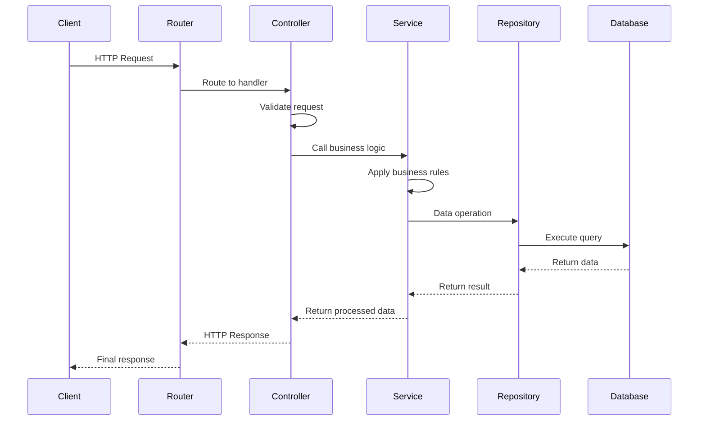
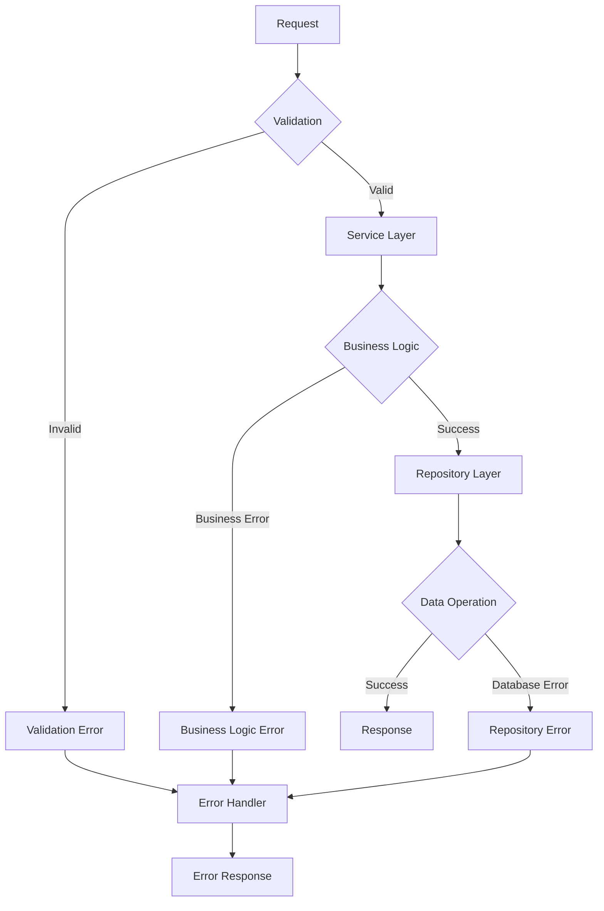
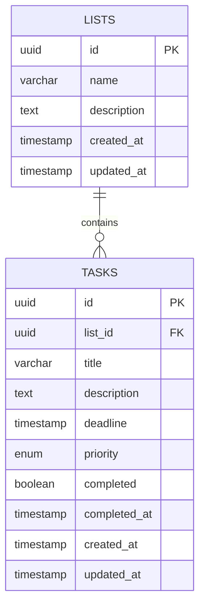

# TODO List API - System Architecture

## Document Information

- **Version**: 1.0
- **Date**: July 2, 2025
- **Author**: Development Team
- **Project**: TODO List API
- **Status**: Design Document

---

## Table of Contents

1. [Architecture Overview](#architecture-overview)
2. [System Components](#system-components)
3. [Layer Architecture](#layer-architecture)
4. [Data Flow](#data-flow)
5. [Database Design](#database-design)
6. [API Design](#api-design)
7. [Technology Stack](#technology-stack)
8. [Design Patterns](#design-patterns)
9. [Security Architecture](#security-architecture)
10. [Performance Considerations](#performance-considerations)
11. [Deployment Architecture](#deployment-architecture)
12. [Development Workflow](#development-workflow)

---

## Architecture Overview

The TODO List API follows a **layered architecture** pattern with clear separation of concerns,
implementing Domain-Driven Design (DDD) principles and SOLID design patterns.

### High-Level Architecture Diagram

```
┌─────────────────────────────────────────────────────────────┐
│                     Client Applications                     │
│  (Web Apps, Mobile Apps, Third-party Integrations)        │
└─────────────────────────────────────────────────────────────┘
                                │
                    ┌───────────▼───────────┐
                    │    Load Balancer      │
                    │   (nginx/AWS ALB)     │
                    └───────────┬───────────┘
                                │
┌─────────────────────────────────────────────────────────────┐
│                     API Gateway Layer                       │
│  ┌─────────────┐ ┌─────────────┐ ┌─────────────────────────┐│
│  │  Rate       │ │   CORS      │ │    Authentication       ││
│  │  Limiting   │ │  Middleware │ │     & Authorization     ││
│  └─────────────┘ └─────────────┘ └─────────────────────────┘│
└─────────────────────────────────────────────────────────────┘
                                │
┌─────────────────────────────────────────────────────────────┐
│                    Application Layer                        │
│  ┌─────────────────────────────────────────────────────────┐│
│  │              Express.js Server                          ││
│  │  ┌─────────────┐ ┌─────────────┐ ┌─────────────────────┐││
│  │  │   Routes    │ │Controllers  │ │    Middleware       │││
│  │  │ (Endpoints) │ │ (Handlers)  │ │  (Validation, etc.) │││
│  │  └─────────────┘ └─────────────┘ └─────────────────────┘││
│  └─────────────────────────────────────────────────────────┘│
└─────────────────────────────────────────────────────────────┘
                                │
┌─────────────────────────────────────────────────────────────┐
│                     Service Layer                           │
│  ┌─────────────┐ ┌─────────────┐ ┌─────────────────────────┐│
│  │    List     │ │    Task     │ │      Validation         ││
│  │   Service   │ │   Service   │ │     & Business Logic    ││
│  └─────────────┘ └─────────────┘ └─────────────────────────┘│
└─────────────────────────────────────────────────────────────┘
                                │
┌─────────────────────────────────────────────────────────────┐
│                   Repository Layer                          │
│  ┌─────────────┐ ┌─────────────┐ ┌─────────────────────────┐│
│  │   Memory    │ │     SQL     │ │    Repository Factory   ││
│  │ Repository  │ │ Repository  │ │   (Strategy Pattern)    ││
│  └─────────────┘ └─────────────┘ └─────────────────────────┘│
└─────────────────────────────────────────────────────────────┘
                                │
┌─────────────────────────────────────────────────────────────┐
│                     Data Layer                              │
│  ┌─────────────┐ ┌─────────────┐ ┌─────────────────────────┐│
│  │  In-Memory  │ │  PostgreSQL │ │       Migration         ││
│  │    Store    │ │  Database   │ │        System           ││
│  └─────────────┘ └─────────────┘ └─────────────────────────┘│
└─────────────────────────────────────────────────────────────┘
```

---

## System Components

### Core Components

| Component            | Responsibility                       | Technology             |
| -------------------- | ------------------------------------ | ---------------------- |
| **API Gateway**      | Request routing, rate limiting, CORS | Express.js Middleware  |
| **Controllers**      | HTTP request/response handling       | Express.js Controllers |
| **Services**         | Business logic and validation        | TypeScript Classes     |
| **Repositories**     | Data access abstraction              | Repository Pattern     |
| **Data Stores**      | Data persistence                     | Memory/PostgreSQL      |
| **Migration System** | Database schema management           | Custom TypeScript      |

### Supporting Components

| Component         | Responsibility                | Technology      |
| ----------------- | ----------------------------- | --------------- |
| **Logger**        | Application logging           | Winston/Pino    |
| **Validator**     | Input validation              | Joi/Zod         |
| **Documentation** | API documentation             | Swagger/OpenAPI |
| **Testing**       | Unit/Integration tests        | Jest            |
| **Build System**  | Development/Production builds | Vite            |

---

## Layer Architecture

### 1. API Layer (Presentation)

**Responsibility**: Handle HTTP requests, response formatting, and routing

```typescript
// Structure
src/
├── controllers/
│   ├── listController.ts
│   ├── taskController.ts
│   └── queryController.ts
├── routes/
│   ├── listRoutes.ts
│   ├── taskRoutes.ts
│   └── index.ts
└── middleware/
    ├── errorHandler.ts
    ├── validation.ts
    ├── cors.ts
    └── rateLimiter.ts
```

**Key Features**:

- RESTful endpoint implementation
- Request/response validation
- Error handling and HTTP status codes
- OpenAPI/Swagger documentation
- CORS and security headers
- Rate limiting

### 2. Service Layer (Business Logic)

**Responsibility**: Implement business rules, validation, and orchestration

```typescript
// Structure
src/services/
├── listService.ts
├── taskService.ts
├── queryService.ts
├── dateUtils.ts
└── validators/
    ├── listValidator.ts
    └── taskValidator.ts
```

**Key Features**:

- Business logic implementation
- Data validation and sanitization
- Cross-cutting concerns (logging, caching)
- Transaction management
- Domain-specific operations

### 3. Repository Layer (Data Access)

**Responsibility**: Abstract data persistence and provide uniform data access

```typescript
// Structure
src/repositories/
├── interfaces/
│   ├── IListRepository.ts
│   └── ITaskRepository.ts
├── memory/
│   ├── listMemoryRepository.ts
│   ├── taskMemoryRepository.ts
│   └── memoryStore.ts
├── sql/
│   ├── listSqlRepository.ts
│   ├── taskSqlRepository.ts
│   └── sqlConnection.ts
└── repositoryFactory.ts
```

**Key Features**:

- Repository pattern implementation
- Multiple data store support (Memory/SQL)
- Connection pooling and optimization
- Query building and execution
- Transaction support

---

## Data Flow

### Request Processing Flow



### Error Handling Flow



---

## Database Design

### Entity Relationship Diagram



### Database Schema

#### Lists Table

```sql
CREATE TABLE lists (
    id UUID PRIMARY KEY DEFAULT gen_random_uuid(),
    name VARCHAR(100) NOT NULL,
    description TEXT,
    created_at TIMESTAMP WITH TIME ZONE DEFAULT NOW(),
    updated_at TIMESTAMP WITH TIME ZONE DEFAULT NOW()
);
```

#### Tasks Table

```sql
CREATE TABLE tasks (
    id UUID PRIMARY KEY DEFAULT gen_random_uuid(),
    list_id UUID NOT NULL REFERENCES lists(id) ON DELETE CASCADE,
    title VARCHAR(200) NOT NULL,
    description TEXT,
    deadline TIMESTAMP WITH TIME ZONE,
    priority task_priority DEFAULT 'medium',
    completed BOOLEAN DEFAULT FALSE,
    completed_at TIMESTAMP WITH TIME ZONE,
    created_at TIMESTAMP WITH TIME ZONE DEFAULT NOW(),
    updated_at TIMESTAMP WITH TIME ZONE DEFAULT NOW()
);

CREATE TYPE task_priority AS ENUM ('low', 'medium', 'high');
```

#### Indexes for Performance

```sql
-- Indexes for common query patterns
CREATE INDEX idx_tasks_list_id ON tasks(list_id);
CREATE INDEX idx_tasks_deadline ON tasks(deadline) WHERE deadline IS NOT NULL;
CREATE INDEX idx_tasks_completed ON tasks(completed);
CREATE INDEX idx_tasks_priority ON tasks(priority);
CREATE INDEX idx_tasks_created_at ON tasks(created_at);

-- Composite indexes for complex queries
CREATE INDEX idx_tasks_list_completed ON tasks(list_id, completed);
CREATE INDEX idx_tasks_deadline_completed ON tasks(deadline, completed) WHERE deadline IS NOT NULL;
```

---

## API Design

### RESTful Endpoints

| Method | Endpoint                     | Description             | Request Body        | Response                           |
| ------ | ---------------------------- | ----------------------- | ------------------- | ---------------------------------- |
| GET    | `/api/lists`                 | Get all lists           | None                | Array of lists with task summaries |
| POST   | `/api/lists`                 | Create new list         | List object         | Created list                       |
| GET    | `/api/lists/{id}`            | Get specific list       | None                | List with tasks                    |
| PUT    | `/api/lists/{id}`            | Update list             | Updated list object | Updated list                       |
| DELETE | `/api/lists/{id}`            | Delete list             | None                | Confirmation                       |
| GET    | `/api/lists/{id}/tasks`      | Get tasks in list       | None                | Array of tasks                     |
| POST   | `/api/lists/{id}/tasks`      | Create task in list     | Task object         | Created task                       |
| GET    | `/api/tasks/{id}`            | Get specific task       | None                | Task object                        |
| PUT    | `/api/tasks/{id}`            | Update task             | Updated task object | Updated task                       |
| DELETE | `/api/tasks/{id}`            | Delete task             | None                | Confirmation                       |
| PATCH  | `/api/tasks/{id}/deadline`   | Set task deadline       | Deadline date       | Updated task                       |
| PATCH  | `/api/tasks/{id}/completion` | Toggle completion       | Completion status   | Updated task                       |
| GET    | `/api/tasks/due-this-week`   | Get tasks due this week | None                | Array of tasks                     |
| GET    | `/api/tasks?sortBy=deadline` | Get sorted tasks        | None                | Array of sorted tasks              |

### Request/Response Format

#### Standard Response Structure

```typescript
interface ApiResponse<T> {
  data: T;
  meta?: {
    pagination?: PaginationMeta;
    total?: number;
  };
  errors?: ApiError[];
}

interface ApiError {
  code: string;
  message: string;
  field?: string;
  details?: Record<string, any>;
}
```

#### Pagination Format

```typescript
interface PaginationMeta {
  page: number;
  limit: number;
  total: number;
  totalPages: number;
  hasNext: boolean;
  hasPrev: boolean;
}
```

---

## Technology Stack

### Backend Framework

- **Express.js**: Web application framework
- **TypeScript**: Type-safe JavaScript
- **Node.js**: Runtime environment

### Development Tools

- **Vite**: Build tool and development server
- **ESLint**: Code linting
- **Prettier**: Code formatting
- **Jest**: Testing framework
- **Nodemon**: Development auto-restart

### Database & Storage

- **PostgreSQL**: Primary database (production)
- **In-Memory Store**: Development/testing storage
- **Connection Pooling**: pg-pool for database connections

### Documentation & API

- **Swagger/OpenAPI**: API documentation
- **JSDoc/TSDoc**: Code documentation
- **JSON Schema**: Request/response validation

### Monitoring & Logging

- **Winston/Pino**: Application logging
- **Morgan**: HTTP request logging
- **Health Checks**: Application monitoring

---

## Design Patterns

### 1. Repository Pattern

**Purpose**: Abstract data access logic and provide a uniform interface

```typescript
interface IListRepository {
  findAll(): Promise<List[]>;
  findById(id: string): Promise<List | null>;
  create(list: CreateListDto): Promise<List>;
  update(id: string, list: UpdateListDto): Promise<List>;
  delete(id: string): Promise<void>;
}
```

### 2. Factory Pattern

**Purpose**: Create repository instances based on environment

```typescript
class RepositoryFactory {
  static createListRepository(): IListRepository {
    return process.env.NODE_ENV === 'production'
      ? new ListSqlRepository()
      : new ListMemoryRepository();
  }
}
```

### 3. Strategy Pattern

**Purpose**: Switch between different data storage strategies

```typescript
class DataStorageStrategy {
  constructor(private repository: IRepository) {}

  async execute(operation: string, ...args: any[]) {
    return this.repository[operation](...args);
  }
}
```

### 4. Dependency Injection

**Purpose**: Loose coupling between components

```typescript
class ListService {
  constructor(
    private listRepository: IListRepository,
    private taskRepository: ITaskRepository,
    private logger: ILogger
  ) {}
}
```

### 5. Middleware Pattern

**Purpose**: Request/response processing pipeline

```typescript
const middlewareStack = [
  corsMiddleware,
  rateLimitMiddleware,
  authenticationMiddleware,
  validationMiddleware,
  errorHandlerMiddleware
];
```

---

## Security Architecture

### Authentication & Authorization

```typescript
// Future implementation ready
interface AuthenticationStrategy {
  validateApiKey(key: string): Promise<boolean>;
  validateJWT(token: string): Promise<User | null>;
}
```

### Input Validation

- **Request Validation**: JSON schema validation
- **SQL Injection Prevention**: Parameterized queries
- **XSS Prevention**: Input sanitization
- **Rate Limiting**: Request throttling

### Security Headers

```typescript
const securityHeaders = {
  'X-Content-Type-Options': 'nosniff',
  'X-Frame-Options': 'DENY',
  'X-XSS-Protection': '1; mode=block',
  'Strict-Transport-Security': 'max-age=31536000'
};
```

---

## Performance Considerations

### Database Optimization

- **Indexing Strategy**: Optimized indexes for common queries
- **Connection Pooling**: Efficient database connections
- **Query Optimization**: Efficient SQL queries
- **Lazy Loading**: Load data only when needed

### Caching Strategy

```typescript
interface CacheStrategy {
  get(key: string): Promise<any>;
  set(key: string, value: any, ttl?: number): Promise<void>;
  invalidate(pattern: string): Promise<void>;
}
```

### Response Optimization

- **Pagination**: Limit large result sets
- **Field Selection**: Return only requested fields
- **Compression**: gzip response compression
- **HTTP Caching**: Appropriate cache headers

---

## Deployment Architecture

### Container Strategy

```dockerfile
# Multi-stage build for optimized production image
FROM node:18-alpine AS builder
WORKDIR /app
COPY package*.json ./
RUN npm ci --only=production

FROM node:18-alpine AS production
WORKDIR /app
COPY --from=builder /app/node_modules ./node_modules
COPY dist ./dist
EXPOSE 3001
CMD ["node", "dist/server.js"]
```

### Environment Configuration

```typescript
interface EnvironmentConfig {
  NODE_ENV: 'development' | 'staging' | 'production';
  PORT: number;
  DATABASE_URL: string;
  REPOSITORY_TYPE: 'memory' | 'sql';
  LOG_LEVEL: 'debug' | 'info' | 'warn' | 'error';
}
```

### Health Checks

```typescript
// Health check endpoint
app.get('/health', (req, res) => {
  const health = {
    status: 'healthy',
    timestamp: new Date().toISOString(),
    uptime: process.uptime(),
    database: 'connected', // Check actual DB connection
    memory: process.memoryUsage()
  };
  res.status(200).json(health);
});
```

---

## Development Workflow

### Code Organization

```
src/
├── app.ts              # Express app configuration
├── server.ts           # Server startup
├── config/             # Configuration files
├── controllers/        # Request handlers
├── services/           # Business logic
├── repositories/       # Data access
├── middleware/         # Express middleware
├── routes/             # Route definitions
├── types/              # TypeScript types
├── utils/              # Utility functions
├── exceptions/         # Custom exceptions
└── tests/              # Test files
```

### Build Process

1. **Development**: Vite dev server with hot reload
2. **Type Checking**: TypeScript compilation
3. **Code Quality**: ESLint and Prettier
4. **Testing**: Jest unit and integration tests
5. **Production Build**: Vite production build

### Testing Strategy

- **Unit Tests**: Services and utilities (80%+ coverage)
- **Integration Tests**: API endpoints and database
- **Performance Tests**: Load testing and benchmarks
- **Security Tests**: Vulnerability scanning

---

## Migration Strategy

### Database Migrations

```typescript
interface Migration {
  version: string;
  description: string;
  up: () => Promise<void>;
  down: () => Promise<void>;
}
```

### Version Management

- **Semantic Versioning**: API version management
- **Backward Compatibility**: Maintain API compatibility
- **Deprecation Strategy**: Graceful feature deprecation

---

## Monitoring & Observability

### Logging Strategy

```typescript
interface LoggerConfig {
  level: 'debug' | 'info' | 'warn' | 'error';
  format: 'json' | 'text';
  destinations: ('console' | 'file' | 'external')[];
}
```

### Metrics Collection

- **Performance Metrics**: Response times, throughput
- **Error Rates**: HTTP error rates and patterns
- **Resource Usage**: CPU, memory, database connections
- **Business Metrics**: API usage patterns

---

This architecture document provides a comprehensive guide for developing, deploying, and maintaining
the TODO List API system. It serves as the foundation for all development decisions and ensures
consistency across the development team.
